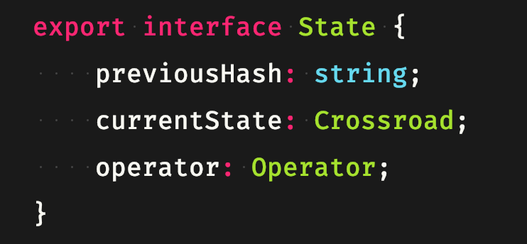

# Bláznivá križovatka

**Škola**: Slovenská Technická Univerzita v Bratislave <br/>
**Fakulta**: Fakulta informatiky a informačných technológií <br/>
**Predmet**: Umelá inteligencia <br/>
**Študent**: Bc. František Gič <br/>
**Cvičiaci**: Ing. Ivan Kapustík <br/>

## Zadanie

Úlohou je nájsť riešenie hlavolamu _Bláznivá križovatka_.
Hlavolam je reprezentovaný mriežkou, ktorá má rozmery 6 krát 6 políčok
a obsahuje niekoľko vozidiel (áut a nákladiakov) rozložených na mriežke tak, aby sa neprekrývali.
Všetky vozidlá majú šírku 1 políčko, autá sú dlhé 2 a nákladiaky sú dlhé 3 políčka.
V prípade, že vozidlo nie je blokované iným vozidlom alebo okrajom mriežky,
môže sa posúvať dopredu alebo dozadu, nie však do strany, ani sa nemôže otáčať.
V jednom kroku sa môže pohybovať len jedno vozidlo.
V prípade, že je pred (za) vozidlom voľných n políčok, môže sa vozidlo pohnúť o 1 až n políčok dopredu (dozadu).
Ak sú napríklad pred vozidlom voľné 3 políčka (napr. oranžové vozidlo na počiatočnej pozícii, obr. 1),
to sa môže posunúť buď o 1, 2, alebo 3 políčka.
Hlavolam je vyriešený, keď je červené auto (v smere jeho jazdy) na okraji križovatky a môže z nej teda dostať von.
Predpokladajte, že červené auto je vždy otočené horizontálne a smeruje doprava.
Je potrebné nájsť postupnosť posunov vozidiel (nie pre všetky počiatočné pozície táto postupnosť existuje)
tak, aby sa červené auto dostalo von z križovatky alebo vypísať, že úloha nemá riešenie.

## Implementácia

K vypracovaniu tohto zadania boli použité algoritmy neinformovaného prehľadávania stavového priestoru Depth-first search a
Breadth-first search - konkrétne bez použitia rekurzie. <br/>
Programoval som v jazyku _JavaScript_ , lokálnom environmente - _Node.js_ s použitím supersetu _Typescript_ pre striktné otypovanie.

## Inštalácia

Prerekvizity:

-   [Node.js](https://nodejs.org)
-   [Node package manager](https://npmjs.com)

V root adresári spustite nasledovné príkazy:

```
npm install
```

A následne, pre každú transpiláciu typescriptového kódu na javascript a spustenie kódu v node.js:

```
npm run dev
```

<div style="page-break-after: always;"></div>

## Algoritmus

Základný scenár pre prehľadávanie stavov znie nasledovne a jednotlivé body si vysvetlíme na konkrétnej ukážke kódu:

1. **Vytvor počiatočný uzol a umiestni medzi vytvorené a zatiaľ nespracované uzly**

    

    <!--  -->

    Na obrázku máme možnosť vidieť - _crossroad_ je parameter algoritmu, je to počiatočný stav križovatky a umiestňujeme ho do _queue_ - náš stack nespracovaných uzlov

1. **Ak neexistuje žiadny vytvorený a zatiaľ nespracovaný uzol, skonči s neúspechom – riešenie neexistuje.**

    Táto časť algoritmu je reprezentovaná klasickým while cyklom.

    ```
    while(queue.length) {
     ...
    ```

1. **Vyber najvhodnejší uzol z vytvorených a zatiaľ nespracovaných, označ ho aktuálny**

    - Ak tento uzol predstavuje cieľový stav, skonči s úspechom – vypíš riešenie
    - Vytvor nasledovníkov aktuálneho uzla a zaraď ho medzi spracované uzly
    - Vytrieď nasledovníkov a ulož ich medzi vytvorené a zatiaľ nespracované

	<div style="page-break-after: always;"></div>

    

    Na obrázku máme možnosť vidieť kompletný algoritmus. Pokúsim sa ho teda opísať:

    - Z _queue_ uzlov vyberáme prvý. (Nemáme heuristiku, ideme za radom.)
    - Pre každe z vozidiel _vehicles_ vyskúšame všetky možné smery _directions_.
    - Pokiaľ je možné vozidlom pohnúť daným smerom, vznikne nám nový stav (uzol) - _movedState_
    - Následne uzol so stavom vkladáme do hashmapy _visitedStates_. Pokiaľ tam už existoval predtým, daný stav neanalyzujeme.
    - Skontrolujeme či v danom stave nie je vozidlo práve naše cieľové (algoritmus je abstraktný, cieľovým vozidlom môže byť hociktoré z áut)
    - Ak nie, daný stav vložíme:
        - Na koniec zoznamu - _queue_ - v prípade _BFS_
        - Na začiatok zoznamu - v prípade _DFS_

<div style="page-break-after: always;"></div>

## Riešenie

Zadanie som spracoval modulárne pre všetky možné vstupy. Jednotlivé vozidlá sú nastaviteľné, majú nastaviteľné poradie, mená, farebnú reprezentáciu, ako aj ich umiestnenie - čo
sa mi veľmi osvedčilo pri generovaní testovacích súborov - stačilo zmeniť súbor so súradnicami a je možné vygenerovať N testov.

Modulárna je taktiež _MxN_ veľkosť križovatky a _V_ vozidiel, _D_ dĺžok a taktiež auta, ktoré je našim cieľom - stačí napísať jeho meno - napr. _cervene_.
Východ z križovatky - _exit_ sa tak nastaví na pravý okraj križovatky v leveli daného auta.


Za povšimnutie taktiež stojí grafický mód výstupu - okrem stavových reprezentácii, počtu cieľových operátorov ako aj celkový počet uzlov reprezentujem križovatku aj _graficky_ v konzole.

-   V **štandardnom móde** sa do konzole vykreslí počiatočný a koncový stav.
-   V **grafickom móde** sa vykreslí priebežný stav po každom z operátorov (výsledných - správneho riešenia) - čo ma síce núti pamatäť si i stavy, nielen zoznam uzlov a operátorov-
    **<br/> Pre zapnutie grafického módu treba v **`script.ts`** nastaviť** `process.env.PRINT_GRAPHS = '1';`

<div style="page-break-after: always;"></div>

## Reprezentácia údajov problému

### Stav

V mojom riešení predstavuje stav samotná trieda _Crossroad_.
Predstavuje objekt obsahujúci dvojrozmerné pole križovatky, veľkosť (kedže je modulárna).
Obsahuje taktiež pole vozidiel.

### Vozidlo

Údaje o samotnom vozidle vyzerajú nasledovne:


<!--  -->


-   vozidlo je v dvojrozmernom poli križovatky reprezentované číslom, _id_.
-   pre ludsku reprezentaciu vsak vo vystupe operatorov drzime aj nazov vozidla pod stringom - _name_.
-   tretie pole je pre samotný algoritmus nepodstatný, iba pre grafickú reprezentáciu - hovorí akou farbou má byť vykreslené v konzole.
-   moje vozidlá maju modulárnu dĺžku, nie len 2 a 3 - _length_.
-   polarita
-   pozícia - pole dvoch čísel \[i,j]

<div style="page-break-after: always;"></div>

### Operátory

Operátor reprezentuje v každom z uzlov akciu ktorá sa vykonala, aby prišlo k danému stavu.
Obsahuje teda

-   smer, ktorým sa pohybovala (RIGHT,LEFT, UP, DOWN)
-   vozidlo (v skrátenej forme, iba id a názov)
-   počet krokov (koľko krokov sa daným smerom pohybovalo)


<!---->

### Uzol

U nás je daný stav križovatky reprezentovaný triedou _Crossroad_, týmpádom je troška mylné pomenovať uzol ako State.

Obsahuje však :

-   _previousHash_ - keďže JavaScript nemá smerníky, referencujeme sa do hashmapy pomocou kľúča - ktorým je jedinečný hash na predchádzajúci stav
-   _currentState_ - samotný stav ktorý uzol reprezentuje
-   _operator_ - akcia, operátor ktorý sa vykonal aby sa prešlo z predchádzajúceho na aktuálny



<!---->

<div style="page-break-after: always;"></div>

## Testovanie

V testovaní som vykonal 6 rôznych testov, v ktorých som menil polohy vozidiel, ako aj aj poradie operátorov.
Následne som porovnával počet celkových uzlov, počet reálnych krokov.

### Test 1 (zadanie)

**Počiatočný stav**: ako v zadaní<br/>
**Cieľové vozidlo**: ako v zadaní<br/>
**Smery (poradie)**: `UP, RIGHT, DOWN, LEFT`

#### DFS

<!--  -->

#### BFS

<!---->

Vidíme, že v prípade Depth-first searchu prehladal daný algoritmu síce menej jednotlivých uzlov - stavov,
avšak výsledná sekvencia operátorov je príliš dlhá na spracovanie.
Opačne, Breadth-first search prešiel množstvo rôznych stavov, ale prvá cieľová sekvencia ktorú našiel bola dlhá len 10 krokov (operátorov) !

<div style="page-break-after: always;"></div>

### Test 2
_Poznámka: Pre debugovacie potreby sme upravili výpis programu - grafické časti, ako aj výpis operandov pokiaľ je dlhší_
<br/>V tomto teste sme len zmenili horizontálnu pozíciu zeleného a horizontálnu tmavomodrého nákladiaku.

#### DFS


#### BFS


Vidíme že v tomto teste sa DFS veľmi potrápil - a to ide len o tri kroky ktoré človek vidí na prvý pohľad.
Chápeme však, čo je za tým. Dôležitým faktorom v oboch algoritmoch je poradie áut, i poradie operátorov.
V tomto teste prešiel skoro všetky ostatné vozidlá až kým sa dostal k zelenému - čo vytvára veľké množstvo stavov.

<div style="page-break-after: always;"></div>

### Test 3
Schválne sme vybrali nastavenie, ktoré je jednoznačné.
Nastavili sme ako prvý smer doprava, a vozidlá sme upravili tak, aby cieľové vozidlo malo voľnú cestu.
Predpokladali sme, že BFS totálne zvalcuje DFS a tak sa aj stalo.
Týmto sme potvrdili hypotézu o vplyve poradia smerov na počet celkových uzlov algoritmu.

#### DFS


#### BFS


<div style="page-break-after: always;"></div>

### Test 4
Schválny test, na otestovanie správnosti implementácie algoritmov.

#### DFS


#### BFS


<div style="page-break-after: always;"></div>

### Test 5
Pre demonštráciu modularity cieľového vozidla sme vytvorili test s blokádou sivého autíčka a nastavním sivého ako nášho cieľového vozidla.

#### DFS


#### BFS


<div style="page-break-after: always;"></div>

### Test 6

Posledným krokom je demonštrácia modularity samotnej križovatky.
A taktiež demonštrácia, že __BFS (aj keď to z niektorých naších testov vyzeralo) nemusí byť vždy lepší__. Všetko totiž závisí od daného vstupu, a preto sme vytvorili jeden nasledovný.
Zväčšili sme plán na 8x8, cieľové autíčko je sivé a zablokovali sme ho. V prípade DFS - prvý hit, síce 626 krokov, ale málo (6k) uzlov.
Tento setup však bol oriešok pre BFS a trval asi najviac zo všetkých - okolo jednej minúty (Quad core i5 2.4GhZ, 16GB RAM).
55 tisic uzlov!

#### DFS


#### BFS


<div style="page-break-after: always;"></div>

## Záver
Väčšinu problémov som vysvetlil v samotnom testovaní. Z neho vyplýva nasledovné: Úspešnosť neinformovaných prehľadávaní bez akéhokoľvek ohodnotenia daných stavov je síce v niektorých prípadoch výhodné, ale veľmi závisí od daného nastavenia - vstupu, pozície autíčok, poradiu operátorov - smerov.
V mojom zadaní by som vylepšil napríklad počet krokov - momentálne sa autíčka pohybujú v jednej operácií o jeden krok, i keď je to pripravené na modulárny pohyb (stačí zmeniť parameter funkcie). Bolo by zaujímave sledovať napríklad správanie pri maximálnom možnom pohybe - pohybovať vozidlo, kým nenarazí.

